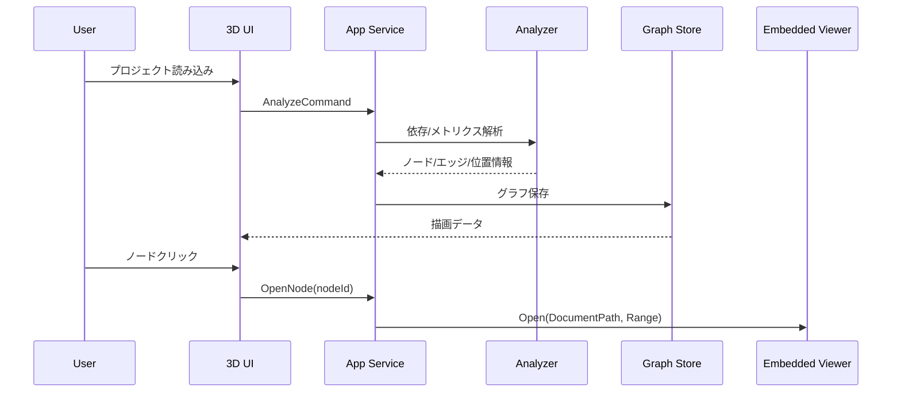

# 依存可視化コア設計

## 1. 目的
- C#ソースコードを静的解析し、Type単位の依存関係とホットスポット重みを算出する。
- 解析結果を3Dグラフで可視化し、ノード選択からコード閲覧へ遷移できるようにする。

## 2. スコープ
- 対象:
  - `.sln` / `.csproj` 入力
  - 依存抽出（`reference` / `inherit` / `implement`）
  - 重み算出（静的メトリクス）
  - 3Dグラフ表示と選択操作
  - 内蔵ビューアへの遷移情報提供
- 対象外:
  - 実行時プロファイル
  - 動的ディスパッチの完全解決

## 3. 論理アーキテクチャ


## 4. データモデル


## 5. 依存抽出ルール
- 抽出単位: `NamedTypeSymbol`（class/struct/record/interface）
- エッジ種別:
  - `reference`: フィールド型、プロパティ型、引数型、戻り値型、`new`、静的メンバー参照
  - `inherit`: 基底クラス
  - `implement`: 実装インターフェース
- 除外:
  - `System.*` など外部BCLはノード生成しない（集約カウントのみ可）
  - 解析不能シンボルは `confidence = estimated`

## 6. 重み（ホットスポット）算出
### 6.1 指標
- `MethodCount`
- `StatementCount`
- `BranchCount`
- `CallSiteCount`
- `FanOut`
- `InDegree`

### 6.2 正規化
- 各指標 `x` を `log1p(x)` 化
- 対象集合の `P95` でクリップし `0..1` にスケール

### 6.3 合成スコア
```text
WeightScore =
  0.15*MethodCountN +
  0.30*StatementCountN +
  0.20*BranchCountN +
  0.20*CallSiteCountN +
  0.10*FanOutN +
  0.05*InDegreeN
```
- 係数は `AnalysisOptions` で変更可能（未指定時は上記既定値）。
- 実行時は係数合計が1になるよう正規化して適用する。

### 6.4 判定
- 上位10%: `Hotspot`
- 上位3%: `Critical`
- 判定閾値（`HotspotTopPercent` / `CriticalTopPercent`）は `AnalysisOptions` で変更可能。

## 7. 3D表示仕様
- ノード:
  - ラベル: 型の単純名（例: `Sample.ServiceImpl` -> `ServiceImpl`）を常時表示
  - サイズ: `WeightScore`
  - 色: 通常（青系）/ Hotspot（橙）/ Critical（赤）
  - 選択時に強調表示し、右上の情報パネルへ以下を表示
    - `Class`（完全修飾名）
    - `Label`（表示名）
    - `Methods`（コンストラクタ/メソッド名一覧）
- エッジ:
  - 色分け: `reference` / `inherit` / `implement`
  - 矢印で方向を表示
- 基本操作:
  - 左クリック: ノード選択
  - 右ドラッグ: 回転
  - 左ドラッグ: 平行移動（パン）
  - ホイール: ズーム
  - 自動回転は無効（静止状態を基準）
  - `ノード倍率` スライダー（0.6〜2.4）
  - `距離倍率` スライダー（0.6〜2.6）
  - ノード選択、検索、フォーカス

## 8. ビューア連携仕様
- ノード選択時に `SymbolLocation` を解決
- 内蔵ビューアへ `DocumentPath + Range` を渡して表示
- 初期表示はReadOnly（編集機能は持たない）

## 9. 主要フロー


## 10. 非機能
- 初回解析目標: 中規模ソリューションで60秒以内
- ノード選択からビューア表示: 500ms以内（キャッシュ時）
- メモリ: 解析対象の構文木キャッシュを再利用し再解析時間を抑制
- ベンチ基準（`tests/Fixtures/MediumBenchmark`）:
  - ノード数: 82
  - エッジ数: 320
  - 解析時間: 20秒以内（回帰検知用の上限）

## 11. 受入対応
- A1, A2, A3 を本設計でカバーする。

## 12. テスト方針（TDD）
- 本機能はTDDで実装する。
- 最低限の先行テスト:
  - 依存抽出ルール（`reference`/`inherit`/`implement`）の単体テスト
  - 重み計算（正規化/合成スコア）の単体テスト
  - ノード選択からビューア遷移までの連携テスト

## 13. ホスト実装方針（WPF + WebView2）
- ホストは `src/DepSphere.App` に分離し、`DepSphere.Analyzer` を参照して描画HTML/コードHTMLを受け取る。
- UI構成:
  - 左ペイン: 操作・状態・選択ノード表示
  - 中央ペイン: 3Dグラフ（`GraphViewHtmlBuilder`）
  - 右ペイン: コードビュー（`SourceCodeViewerHtmlBuilder`）
- イベント連携:
  - 中央WebViewでノードクリック
  - `nodeSelected` メッセージをホストが受信
  - `GraphSelectionCoordinator` でコード取得
  - 右ペインへHTML再描画
- フォールバック:
  - SourceLocationが無い場合はノードのメトリクス情報を右ペインへ表示する。
- 解析入力導線:
  - WebView2 初期化完了までは操作系UIを無効化し、初期化完了後に有効化する。
  - WebView2 の `UserDataFolder` は `LocalAppData/DepSphere/WebView2` 配下を使用し、アクセス拒否を回避する。
  - 左ペインの `ProjectPathTextBox` + `参照` ボタンで `.sln/.csproj` を選択する。
  - `解析実行` ボタンで `DependencyAnalyzer.AnalyzePathAsync` を起動し、中央グラフと右ペイン初期表示を更新する。
  - `再解析` は直近の解析パスを優先し、未指定時はサンプル解析にフォールバックする。
  - 解析実行中は入力系ボタンを無効化し、多重実行を防止する。
  - `キャンセル` ボタンで `CancellationToken` を通知し、停止時は状態表示を `解析をキャンセルしました。` に更新する。
  - 解析中の状態表示は `prepare/load/compile/metrics/complete` ステージで段階更新する。
  - `進捗更新間隔（型件数）` をUIで指定し、`metrics` ステージの更新頻度を調整可能にする。
  - 例外発生時は詳細（型名/メッセージ/StackTrace）を左ペインに表示し、`エラー詳細をコピー` でクリップボードへ出力できる。
- ビルド方針:
  - `net8.0-windows10.0.19041.0` + `UseWPF=true`
  - 非Windows環境ビルドのため `EnableWindowsTargeting=true` を設定する。

## 14. CLI出力導線（Non-Windows向け）
- `src/DepSphere.Cli` で `.sln/.csproj` を解析し、可視化成果物をファイル保存できるようにする。
- 主な引数:
  - `--input`: 解析対象（必須）
  - `--out`: 出力ディレクトリ（既定: `artifacts/depsphere`）
  - `--json`: JSON出力パス（既定: `graph.json`）
  - `--html`: HTML出力パス（既定: `graph.html`）
  - `--edge-stats`: 依存エッジ統計JSON出力パス（既定: `edge-stats.json`）
  - `--progress-interval`: 進捗更新間隔（型件数）
  - `--weight-method/--weight-statement/--weight-branch/--weight-callsite/--weight-fanout/--weight-indegree`: 重み係数
  - `--hotspot-top/--critical-top`: Hotspot/Critical判定閾値
- 出力:
  - `GraphViewJsonSerializer` による `graph.json`
  - `GraphViewHtmlBuilder` による `graph.html`
  - `DependencyEdgeStatisticsBuilder` による `edge-stats.json`
    - `kindStats`: `reference/inherit/implement` ごとの `count` と `density`
    - `density` は有向グラフ密度 `count / (nodeCount * (nodeCount - 1))` で算出（`nodeCount <= 1` は 0）
- CLIは進捗ステージ（`prepare/load/compile/metrics/complete`）を標準出力へ表示する。

## 15. WPF操作仕様 受け入れチェックリスト
### 15.1 前提条件
- 対象環境: Windows 10/11（x64）
- 検証ビルド: `src/DepSphere.App` の Release ビルド
- 入力データ: `.sln` / `.csproj` の実在パス（例: `tests/DepSphere.Analyzer.Tests/Fixtures/SampleWorkspace.sln`）

### 15.2 チェック項目
- [ ] AC-WPF-01: アプリ起動時にクラッシュせず、左/中央/右の3ペインUIが表示される。
- [ ] AC-WPF-02: 起動後にサンプル解析が実行され、中央にグラフ、右に初期メッセージが表示される。
- [ ] AC-WPF-03: `参照` ボタンで `.sln` / `.csproj` を選択でき、選択結果が `ProjectPathTextBox` に反映される。
- [ ] AC-WPF-04: `解析実行` 押下で解析が開始し、入力系UI（参照/解析実行/再解析/入力欄）が無効化される。
- [ ] AC-WPF-05: 解析中の状態表示が `prepare -> load -> compile -> metrics -> complete` の順に更新される。
- [ ] AC-WPF-06: `キャンセル` 押下で解析が停止し、状態表示が `解析をキャンセルしました。` になる。
- [ ] AC-WPF-07: `進捗更新間隔` に数値以外または範囲外（1未満/10000超）を入力した場合、検証エラーが表示される。
- [ ] AC-WPF-08: 中央グラフでノード選択時に右ペインのコード表示が対象ノード内容へ更新される。
- [ ] AC-WPF-09: `SourceLocation` を持たないノード選択時、右ペインにフォールバック情報（メトリクス）が表示される。
- [ ] AC-WPF-10: `再解析` 押下で直近の解析パスを再実行でき、未指定時はサンプル解析にフォールバックする。

### 15.3 判定
- 上記10項目がすべて満たされることを受け入れ条件とする。
