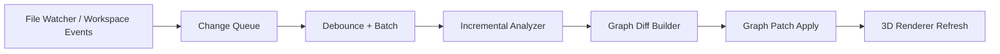
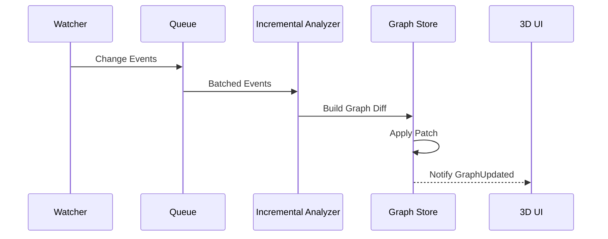

# リアルタイム更新仕様（変更追随）

## 1. 目的
- ファイル変更やクラス移動を検知し、グラフを自動で追随更新する。
- 全再解析を避け、増分再解析で更新遅延を抑える。

## 2. 対象イベント
- `DocumentChanged`
- `DocumentAdded`
- `DocumentRemoved`
- `DocumentRenamed`
- `ClassMoved`（リファクタ機能から発行）

## 3. 更新パイプライン

## 4. コンポーネント仕様
### 4.1 Change Queue
- イベントを時系列で受け取りキュー化
- 同一ドキュメントの短時間連続イベントをマージ

### 4.2 Debounce + Batch
- デバウンス: 250ms
- 最大バッチ: 100イベント
- 連続入力時は1秒ごとに強制フラッシュ

### 4.3 Incremental Analyzer
- 変更ドキュメントの型定義を再抽出
- 逆引きインデックス（`Type -> ReferencedBy`）で影響ノードを展開
- 影響範囲のみ依存・重みを再計算

### 4.4 Graph Diff Builder
- 変更前後を比較して以下を生成
  - `UpsertNodes`
  - `RemoveNodes`
  - `UpsertEdges`
  - `RemoveEdges`

### 4.5 Patch Apply
- パッチ適用はUIに対して原子的に反映
- 適用失敗時は最新整合スナップショットへ復帰

## 5. 増分再解析アルゴリズム

## 6. 一貫性モデル
- モデル: Eventual Consistency（短時間遅延を許容）
- 目標遅延:
  - 単一ファイル変更: 1秒以内
  - クラス移動（プロジェクト間）: 3秒以内

## 7. フォールバック
- 増分解析失敗時:
  - 全再解析ジョブをバックグラウンド起動
  - 完了までUIに「再同期中」を表示

## 8. エラー処理
- パース失敗: 該当ドキュメントを `invalid` として保持し更新継続
- 参照解決失敗: `confidence = estimated` で暫定反映
- 連続失敗閾値超過: 全再解析へ切替

## 9. 監視対象
- `.cs`
- `.csproj`
- `.sln`

## 10. 受入対応
- A5 を本設計でカバーする。

## 11. テスト方針（TDD）
- 本機能はTDDで実装する。
- 最低限の先行テスト:
  - 変更イベントのキュー/マージ/デバウンス挙動
  - 増分再解析の差分生成（Upsert/Remove）検証
  - パッチ適用失敗時のフォールバック（全再解析切替）検証
