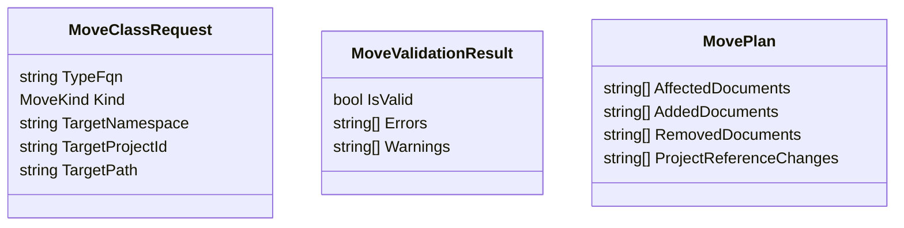
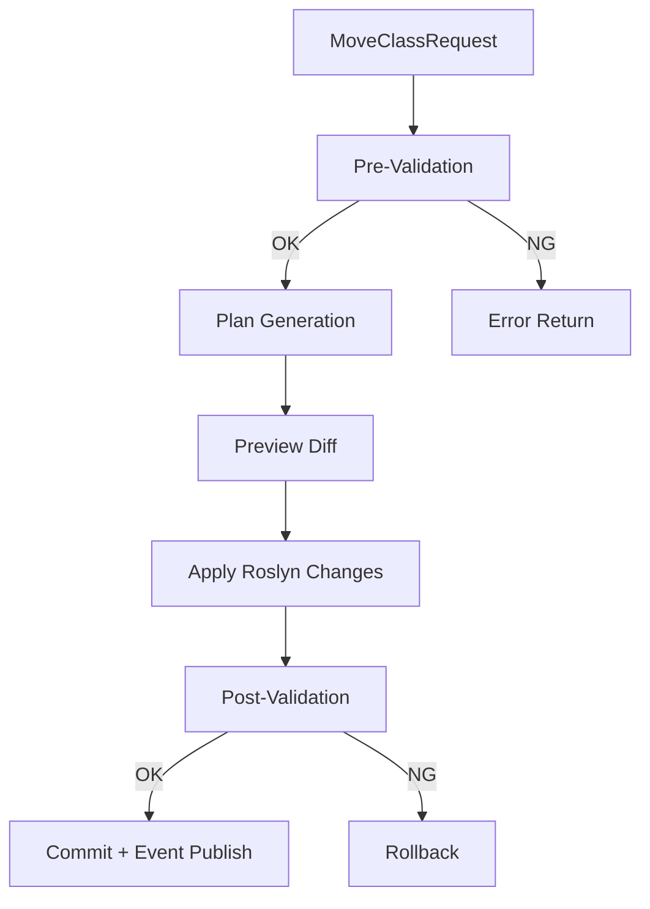

# クラス移動仕様（namespace/ファイル/プロジェクト間）

## 1. 目的
- クラス移動を安全に実行し、参照整合性を維持したまま構造変更できるようにする。

## 2. 対象操作
- `MoveNamespace`: クラスのnamespace変更
- `MoveFile`: クラスのファイル移動
- `MoveProject`: クラスのプロジェクト間移動

## 3. 前提制約
- 解析対象はC#のみ。
- 対象はトップレベル型（親型にネストされた型は親と一体扱い）。
- `partial class` は同一型の全パーツを同時移動する。
- Source Generator生成コードは移動対象外。

## 4. ドメインモデル


## 5. 処理フロー


## 6. 詳細仕様
### 6.1 Pre-Validation
- 対象型の一意解決（`INamedTypeSymbol`）
- 移動先の妥当性確認
  - namespace形式
  - パス衝突
  - 既存同名型衝突
  - プロジェクト参照の循環発生有無（`MoveProject` 時）

### 6.2 Plan Generation
- `MoveNamespace`
  - 対象型の `NamespaceDeclarationSyntax` を更新
  - 影響ドキュメントの `using` を再計算
- `MoveFile`
  - 対象型を新規ドキュメントへ移送
  - 元ドキュメントから対象型を除去
  - 空ファイル化時は削除候補に追加
- `MoveProject`
  - 対象ドキュメントを移送先プロジェクトへ追加
  - 元プロジェクトから対象を除去
  - 必要に応じ `ProjectReference` 変更案を生成

### 6.3 Apply
- Roslyn `Solution` 差分を一括適用（部分適用禁止）
- 適用単位はトランザクションとして扱う

### 6.4 Post-Validation
- 変更後コンパイル（対象プロジェクト群）
- 未解決シンボル/参照エラーを検出
- エラー時はロールバック

## 7. ロールバック
- 適用前 `Solution` スナップショットを保持
- Post-Validation失敗時はスナップショットへ復帰
- UIへエラー原因を返却（型衝突、参照循環、未解決using）

## 8. イベント連携
- 成功時に `ClassMoved` イベントを発行
- ペイロード:
  - `TypeFqn`
  - `MoveKind`
  - `AffectedDocuments`
  - `OldNodeId/NewNodeId`
- イベントはリアルタイム更新パイプラインへ渡す

## 9. API案
```text
MoveValidationResult ValidateMove(MoveClassRequest request)
MovePreviewResult PreviewMove(MoveClassRequest request)
MoveResult ExecuteMove(MoveClassRequest request)
```

## 10. 受入対応
- A4 を本設計でカバーする。

## 11. テスト方針（TDD）
- 本機能はTDDで実装する。
- 最低限の先行テスト:
  - `MoveNamespace` の成功/失敗ケース
  - `MoveFile` の成功/失敗ケース（partial class含む）
  - `MoveProject` の成功/失敗ケース（参照循環、同名衝突）
  - Post-Validation失敗時のロールバック検証
