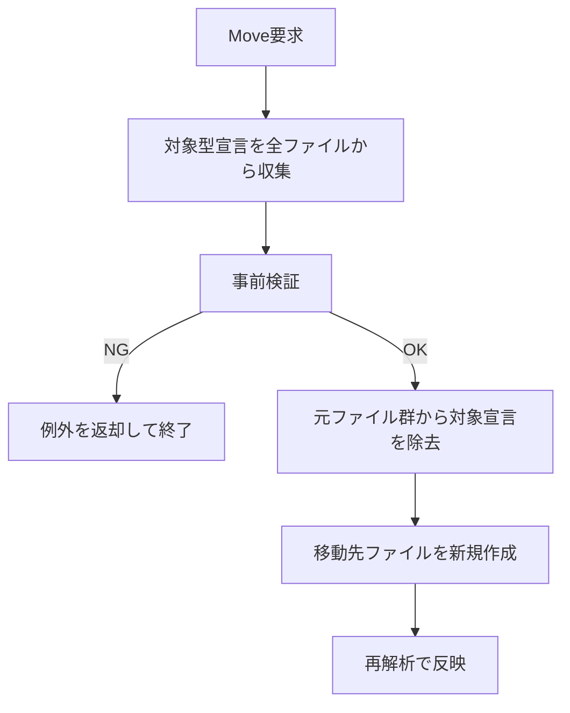

# クラス移動仕様（namespace/ファイル/プロジェクト間）

## 1. 目的
- 静的解析対象の型を安全に移動し、再解析時に依存グラフが追随する状態を維持する。
- 破壊的な誤移動（既存ファイル上書き、同名型衝突）を事前に防止する。

## 2. 対象操作
- `MoveNamespace`: 型を別 namespace へ移動する。
- `MoveFile`: 型を同一プロジェクト内の別 `.cs` ファイルへ移動する。
- `MoveProject`: 型を別プロジェクトへ移動する。

## 3. 現在実装の前提
- 解析対象は C# のトップレベル `TypeDeclarationSyntax`。
- 型識別は `namespace + 型名`（`TypeFqn`）で行う。
- `partial` 型は同一 `TypeFqn` の全宣言を一括移動する。
- `obj/` と `bin/` 配下は探索対象外。

## 4. 処理フロー


## 5. 事前検証ルール
- 共通
  - 対象 `TypeFqn` が存在しない場合は失敗。
  - 移動先ファイルが既に存在する場合は失敗。
- `MoveNamespace`
  - 移動先 namespace に同名型（`targetNamespace + typeName`）が存在する場合は失敗。
- `MoveFile`
  - 移動先ファイルが移動元ファイルと同一パスの場合は失敗。
- `MoveProject`
  - 移動先プロジェクトが存在しない場合は失敗。
  - 移動先プロジェクトに同名型が存在する場合は失敗。

## 6. partial 型の扱い
- 対象 `TypeFqn` と一致する宣言を全 `.cs` ファイルから収集する。
- 収集した宣言をすべて移動先ファイルに連結出力する。
- 元ファイル側は対象宣言のみ削除し、他宣言は保持する。

## 7. 既知の制約
- ネスト型・ジェネリック引数差分を区別した厳密識別は未対応。
- using 最適化や参照整合の自動修復は未対応（再解析で状態確認）。
- ロールバック機構は未実装（失敗時はファイル操作前の検証で防止する方針）。

## 8. API
```text
Task<MoveNamespaceResult> MoveNamespaceAsync(string csprojPath, string typeFqn, string targetNamespace)
Task<MoveFileResult> MoveFileAsync(string csprojPath, string typeFqn, string targetFilePath)
Task<MoveProjectResult> MoveProjectAsync(string sourceProjectPath, string targetProjectPath, string typeFqn, string? targetRelativePath)
```

## 9. テスト方針（TDD）
- 本機能は TDD で進める。
- 回帰テストの最低ライン:
  - `MoveNamespace` 成功 + 同名衝突失敗
  - `MoveFile` 成功 + 既存ファイル衝突失敗
  - `MoveProject` 成功 + 同名衝突失敗
  - `partial` 型の全パーツ同時移動
